# OpenVINO<sup>TM</sup>部署PP-YOLOE模型

# 1. PP-YOLOE模型

&emsp;目标检测作为计算机视觉领域的顶梁柱，不仅可以独立完成车辆、商品、缺陷检测等任务，也是人脸识别、视频分析、以图搜图等复合技术的核心模块，在自动驾驶、工业视觉、安防交通等领域的商业价值有目共睹。

&emsp;PaddleDetection为基于飞桨PaddlePaddle的端到端目标检测套件，内置30+模型算法及250+预训练模型，覆盖目标检测、实例分割、跟踪、关键点检测等方向，其中包括服务器端和移动端高精度、轻量级产业级SOTA模型、冠军方案和学术前沿算法，并提供配置化的网络模块组件、十余种数据增强策略和损失函数等高阶优化支持和多种部署方案，在打通数据处理、模型开发、训练、压缩、部署全流程的基础上，提供丰富的案例及教程，加速算法产业落地应用。

&emsp; PP-YOLOE 是PaddleDetection推出的一种高精度SOTA目标检测模型，基于PP-YOLOv2的卓越的单阶段Anchor-free模型，超越了多种流行的YOLO模型。

- 尺寸多样：PP-YOLOE根据不同应用场景设计了s/m/l/x，4个尺寸的模型来支持不同算力水平的硬件，无论是哪个尺寸，精度-速度的平衡都超越当前所有同等计算量下的YOLO模型！可以通过width multiplier和depth multiplier配置。
- 性能卓越：具体来说，PP-YOLOE-l在COCO test-dev上以精度51.4%，TRT FP16推理速度149 FPS的优异数据，相较YOLOX，精度提升1.3%，加速25%；相较YOLOv5，精度提升0.7%，加速26.8%。训练速度较PP-YOLOv2提高33%，降低模型训练成本。
- 部署友好：与此同时，PP-YOLOE在结构设计上避免使用如deformable convolution或者matrix NMS之类的特殊算子，使其能轻松适配更多硬件。当前已经完备支持NVIDIA V100、T4这样的云端GPU架构以及如Jetson系列等边缘端GPU和FPGA开发板。

# 2. OpenVINO<sup>TM</sup>

&emsp;OpenVINO<sup>TM</sup>是英特尔基于自身现有的硬件平台开发的一种可以加快高性能计算机视觉和深度学习视觉应用开发速度工具套件，用于快速开发应用程序和解决方案，以解决各种任务（包括人类视觉模拟、自动语音识别、自然语言处理和推荐系统等）。                               

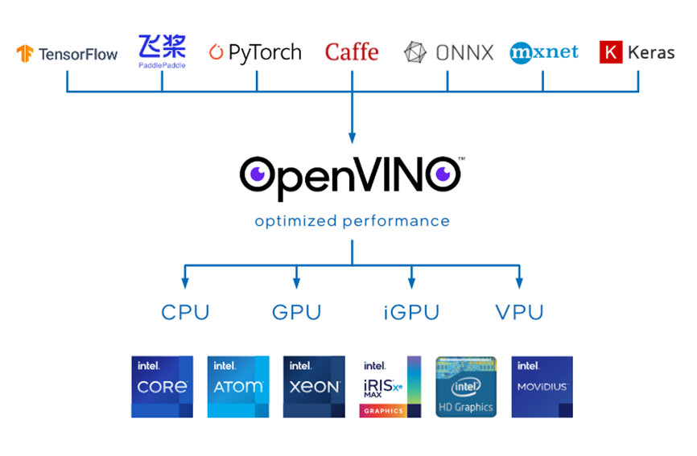


&emsp;该工具套件基于最新一代的人工神经网络，包括卷积神经网络 (CNN)、递归网络和基于注意力的网络，可扩展跨英特尔® 硬件的计算机视觉和非视觉工作负载，从而最大限度地提高性能。它通过从边缘到云部署的高性能、人工智能和深度学习推理来为应用程序加速，并且允许直接异构执行。极大的提高计算机视觉、自动语音识别、自然语言处理和其他常见任务中的深度学习性能；使用使用流行的框架（如TensorFlow，PyTorch等）训练的模型；减少资源需求，并在从边缘到云的一系列英特尔®平台上高效部署；支持在Windows与Linux系统，且官方支持编程语言为Python与C++语言。

&emsp;OpenVINO<sup>TM</sup>工具套件2022.1版于2022年3月22日正式发布，与以往版本相比发生了重大革新，提供预处理API函数、ONNX前端API、AUTO 设备插件，并且支持直接读入飞桨模型，在推理中中支持动态改变模型的形状，这极大地推动了不同网络的应用落地。2022年9月23日，OpenVINO<sup>TM</sup> 工具套件2022.2版推出，对2022.1进行了微调，以包括对英特尔最新 CPU 和离散 GPU 的支持，以实现更多的人工智能创新和机会。

#  3. PP-YOLOE模型下载与转换

## 3.1. 模型下载

&emsp;首先下载PP-YOLOE官方训练模型，该模型由PaddleDetection提供，基于COCO数据集训练，可以识别80种常见物体。此处采用的是PaddleDetection release/2.5版本，PP-YOLOE+模型，具体可以参考官方文件[PP-YOLOE](https://github.com/PaddlePaddle/PaddleDetection/blob/release/2.5/configs/ppyoloe/README_cn.md)。

&emsp;使用命令，导出我们要使用的模型，在命令行种依次输入以下指令，导出我们所使用的模型文件：

```shell
// 打开PaddleDetection代码文件
cd ./PaddleDetection 
// 导出指定模型
python tools/export_model.py -c configs/ppyoloe/ppyoloe_plus_crn_l_80e_coco.yml -o weights=https://paddledet.bj.bcebos.com/models/ppyoloe_plus_crn_l_80e_coco.pdparams
```

&emsp;此处导出的是PP-YOLOE+模型，l_80e格式，导出命令输出如下图所示。

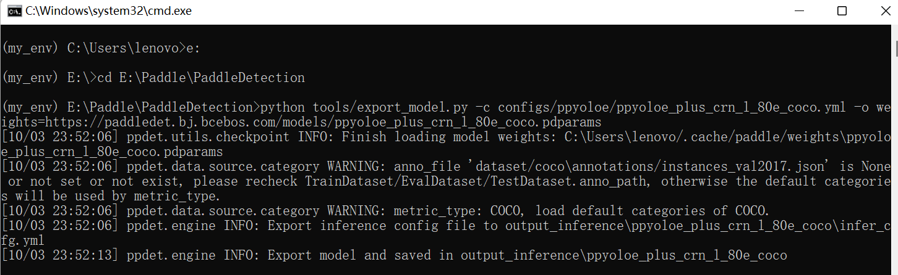

&emsp;模型导出后可以在下述文件夹中找到该模型文件：

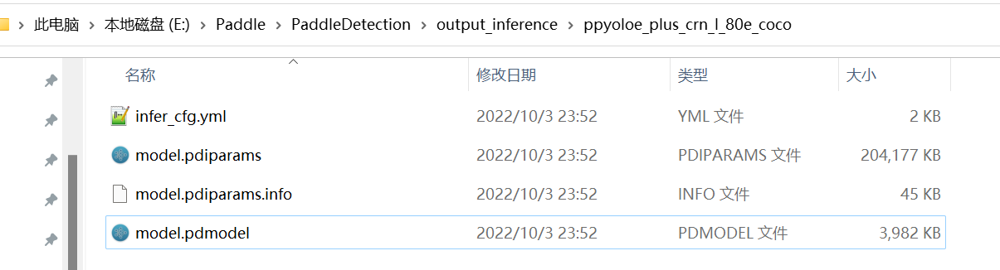

&emsp;利用模型查看器可以看出该模型，包含两个输入、两个输出。

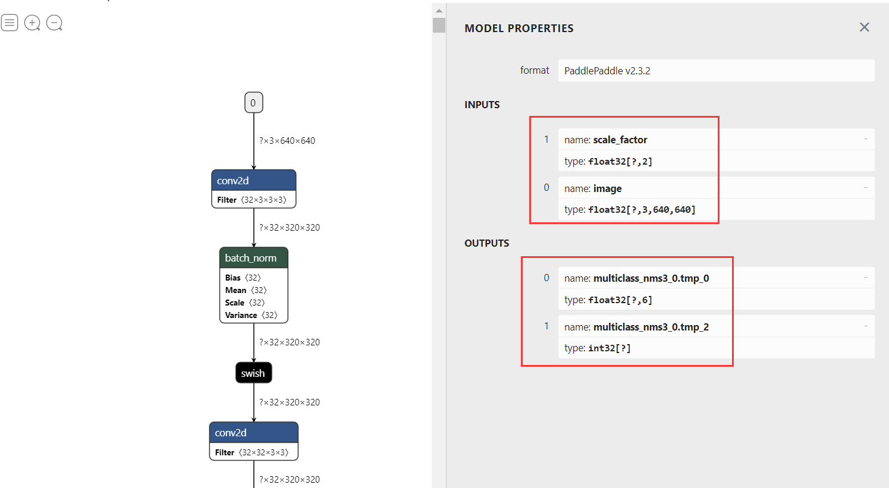

## 3.2 模型裁剪

&emsp;直接导出的模型在OpenVINO中无法直接使用，需要对模型进行裁剪，将模型后处理过程去掉，使用下面大神的提供的工具可以直接实现对Paddle模型直接裁剪：[jiangjiajun/PaddleUtils: Some tools to operate PaddlePaddle model ](https://github.com/jiangjiajun/PaddleUtils)。

&emsp;首先克隆改代码仓到本地：

```shell
git clone https://github.com/jiangjiajun/PaddleUtils.git
```

&emsp;然后打开到该代码文件中下面的一个文件夹下，并将上一步导出的模型复制到该文加夹中

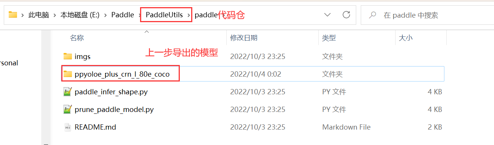

&emsp;在命令提示符中依次输入以下命令：

```shell
// 打开指定文件
cd E:\Paddle\PaddleUtils\paddle
// 模型裁剪
python prune_paddle_model.py --model_dir ppyoloe_plus_crn_l_80e_coco --model_filename model.pdmodel --params_filename model.pdiparams --output_names tmp_16 concat_14.tmp_0 --save_dir export_model
```

&emsp;指令说明：

|      标志位       |       说明       |            输入             |
| :---------------: | :--------------: | :-------------------------: |
|    --model_dir    |   模型文件路径   | ppyoloe_plus_crn_l_80e_coco |
| --model_filename  |  静态图模型文件  |        model.pdmodel        |
| --params_filename | 模型配置文件信息 |       model.pdiparams       |
|  --output_names   |    输出节点名    |   tmp_16 concat_14.tmp_0    |
|    --save_dir     |   模型保存路径   |        export_model         |

&emsp;此处主要关注输出节点名这一项输入，由于原模型输入包含后处理这一部分，在模型部署时会出错，所以模型裁剪的主要目的就是将模型后处理这一步去掉，因此将模型输出设置为后处理开始前的模型节点，此处主要存在两个节点：

&emsp;第一个节点包含模型预测的置信度输出参数，其位置如下图所示：

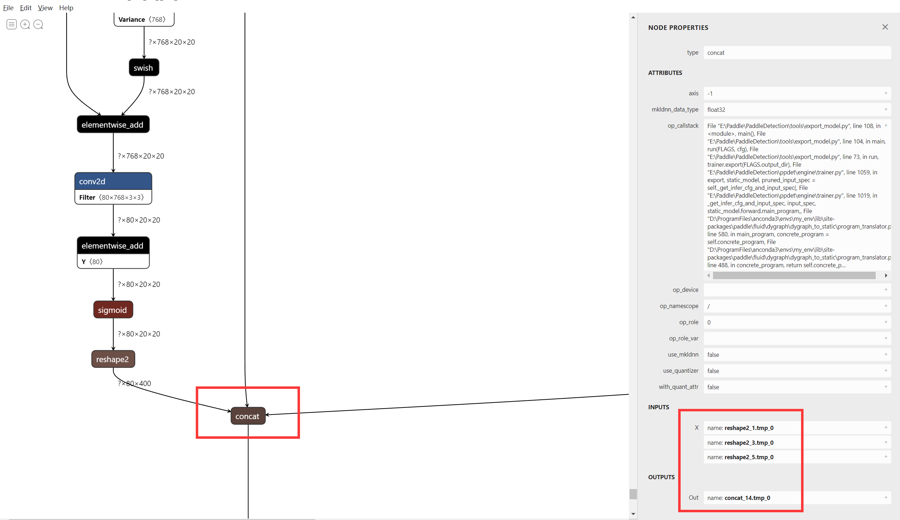

&emsp;第二个节点是模型预测狂输出节点，其位置如下图所示：

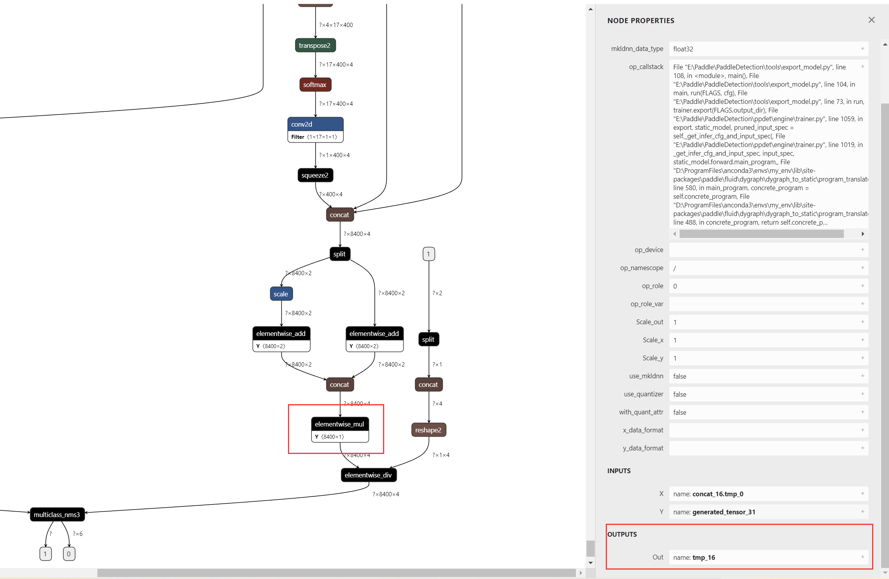


&emsp;输入上述指令后，会获得以下结果：

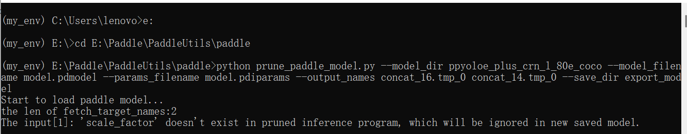

&emsp;在``export_model``文件夹下，可以获得裁剪后的模型文件：

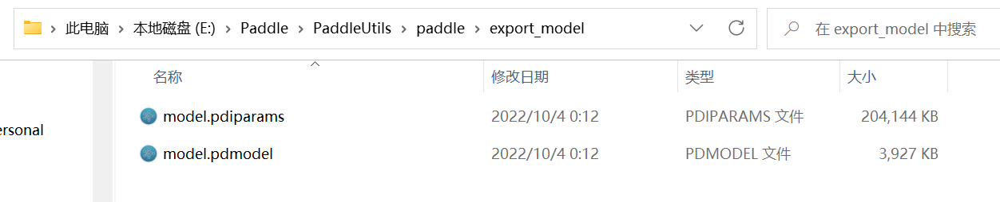

&emsp;使用模型查看器，可以看出导出的模型，输入输出发生了改变。模型的输入仅包含**image**一项，原有的**scale_factor**输入由于在模型中使用不到，被一并削减掉。模型的输出变成我们指定的节点输出。

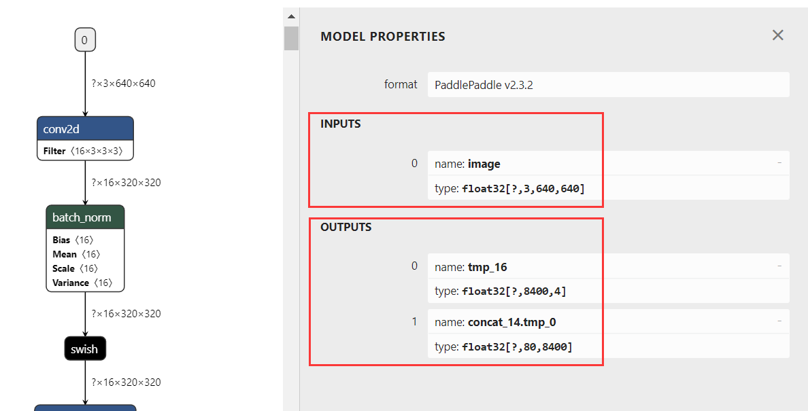


## 3.3 模型转换ONNX

&emsp;由于Paddle模型未指定bath_size大小，在使用时会出现问题，因此通过将该模型转为ONNX并指定bath_size大小，此处使用``paddle2onnx``工具便可以实现。

&emsp;在命令提示符中依次输入以下指令，将上一步导出的模型转为ONNX格式：

```
cd E:\Paddle\PaddleUtils\paddle
// 模型转换
paddle2onnx --model_dir export_model --model_filename model.pdmodel --params_filename model.pdiparams --input_shape_dict "{'image':[1,3,640,640]}" --opset_version 11 --save_file ppyoloe_plus_crn_l_80e_coco.onnx
```

&emsp;此处需要指定模型的输入形状，--input_shape_dict "{'image':[1,3,640,640]}"，其他设置按照常规设置即可，模型输出如下图所示：

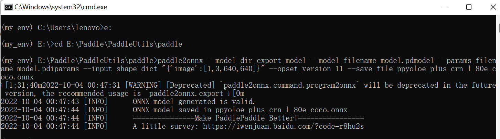


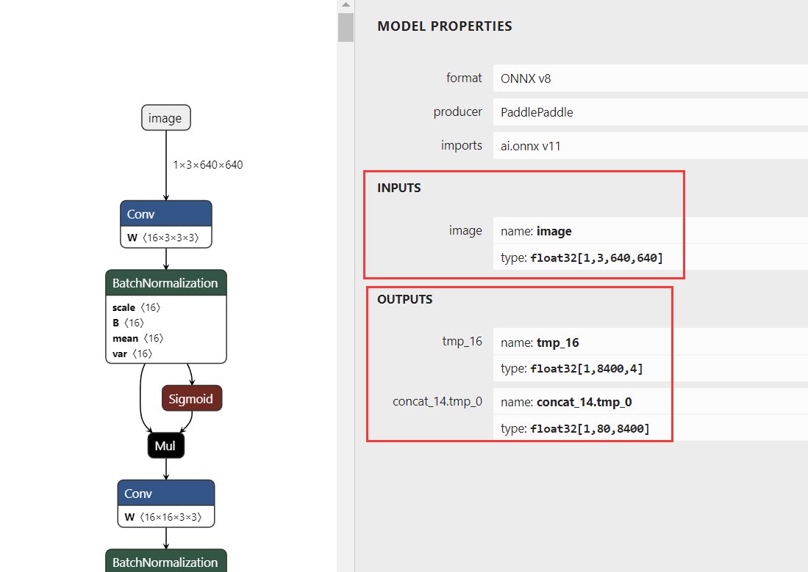

## 3.4 转为IR格式

&emsp; IR格式模型为OpenVINO<sup>TM</sup>推理工具原生支持模型，且对模型进行了进一步优化，使得推理速度大大提升，此处我们使用OpenVINO<sup>TM</sup> 自带的模型优化工具进行转换。

&emsp;首先利用命令提示窗口打开OpenVINO<sup>TM</sup>工具路径，然后输入转换命令，在该文件夹中会生成三个转换后的文件，其输出如图所示，出现三个SUCCESS表示转换成功。

```
cd .\openvino\tools
mo --input_model ppyoloe_plus_crn_l_80e_coco.onnx
```

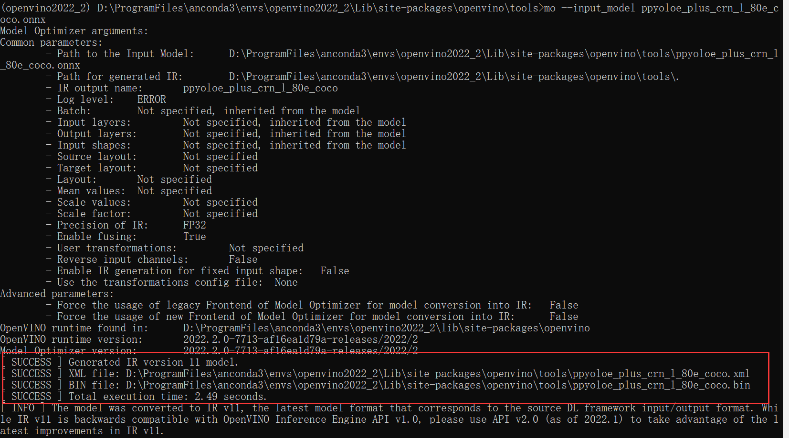


# 4. C++实现

## 4.1 C++项目配置

&emsp; 当前项目部署套件使用的是OpenVINO<sup>TM</sup>，图片处理使用的是OpenCV，所以此处需要配置OpenVINO<sup>TM</sup>和OpenCV两个附加依赖项。

&emsp;项目使用OpenVINO<sup>TM</sup>版本为2022.2，OpenCV版本使用的是4.5.5，具体安装方式可以参考下面三个链接：

[【OpenVINO】OpenVINO 2022.1 安装教程(Windows)](https://blog.csdn.net/grape_yan/article/details/126943858)

[【OpenVINO】OpenVINO 2022.1更新2022.2教程](https://blog.csdn.net/grape_yan/article/details/127022258)

[OpenCV C++安装和配置](https://blog.csdn.net/grape_yan/article/details/126954261)


## 4.2 模型推理类 Predictor

### 4.2.1 推理结构体核心

```c++
// @brief 推理核心结构体
typedef struct openvino_core {
    ov::Core core; // core对象
    std::shared_ptr<ov::Model> model_ptr; // 读取模型指针
    ov::CompiledModel compiled_model; // 模型加载到设备对象
    ov::InferRequest infer_request; // 推理请求对象
} CoreStruct;
```

&emsp;为了方便使用OpenVINO<sup>TM</sup>推理工具，此处将该套件较为重要的几个成员变量封装成推理核心结构体，方便模型在不同方法之间传递。

### 4.2.2 Predictor类结构

```c++
class Predictor {
public:
    // 构造函数
    Predictor(std::string& model_path, std::string& device_name);
    // 析构函数
    ~Predictor() { delete p; }
    // 获取节点张量
    ov::Tensor get_tensor(std::string node_name);
    // 填充图片数据
    void fill_tensor_data_image(ov::Tensor& input_tensor, const cv::Mat& input_image);
    void fill_tensor_data_image(ov::Tensor& input_tensor, const std::vector<cv::Mat> input_image);
    // 模型推理
    void infer();
    // 获取模型输出
    std::vector<float> get_output_data(std::string output_node_name);
private:
    CoreStruct* p;
};
```

&emsp;由于我们此处只进行PP-YOLOE模型的推理，所以无需构建太复杂的推理类，主要包括

- 构造函数``Predictor(model_path, device_name)``：主要实现功能为初始化推理核心，包括读取本地模型，将模型加载到设备，创建推理通道三个步骤；
- 获取节点张量``get_tensor(node_name)``：主要实现功能获取指定节点的张量，主要用于获取输入节点张量；
- 填充输入数据``fill_tensor_data_image(input_tensor, input_image)``：主要实现将带推理数据添加到模型中，支持添加单张图片数据和多通道推理下的多张图片添加；
- 模型推理``infer()``：模型推理功能，按照读取的模型和加载的推理数据计算模型；
- 读取模型输出``get_output_data(output_node_name)``：读取推理模型的输出。

&emsp;针对上诉方法的实现可以参考源码，此处不做详细解释。

## 4.3 图片数据处理类 ImageProcess

```c++
class ImageProcess {
public:
	// 预处理图片
	cv::Mat image_normalize(cv::Mat& sourse_mat, cv::Size& size);
	// 处理推理结果
	cv::Mat yoloe_result_process(cv::Mat& sourse_mat, std::vector<float>& vector_box, std::vector<float>& vector_conf);
	// 读取lable文件
	void read_class_names(std::string path_name);
	// 设置缩放比例
	void set_scale_factor(double scale);
private:
	// 缩放比例
	double scale_factor;
	// lable容器
	std::vector<std::string> class_names;
};
```

&emsp;此处设置一个数据处理类主要用于处理模型的输入输出数据，主要不包括先买几个方法：

- 预处理图片``image_normalize(sourse_mat, size);``：预处理图像数据，包括以下几个处理步骤：1.转换RGB 2.缩放图片  3.图片归一化；
- 处理PP-YOLOE结果``yoloe_result_process(sourse_mat, vector_box, vector_conf)``：由于我们将模型进行了裁剪，去除了模型自带的后处理以及非极大值抑制，因此模型的输出数据较复杂，此处封装该方法主要实现将模型读取的数据按照指定要求进行处理，并绘制到结果图片上；
- 读取lable文件``read_class_names(path_name)``：读取本地lable.txt文件；
- 设置缩放比例``set_scale_factor(scale)``：设置原图与模型输入的缩放比例，用于回复模型预测框。

## 4.4.模型推理实现

### 4.4.1 定义相关信息

```c++
// 模型路径
//std::string model_path = "../model/ppyoloe_plus_crn_s_80e_coco.onnx";
std::string model_path = "../model/ir/ppyoloe_plus_crn_s_80e_coco.xml";
// 设备名称
std::string device_name = "CPU";
// 输入节点
std::string input__node_name = "image";
// 输出节点名
std::string output_box_node_name = "tmp_16";
std::string output_conf_node_name = "concat_14.tmp_0";

// 测试图片
std::string image_path = "../image/demo_3.jpg";
// 类别文件
std::string lable_path = "../model/lable.txt";
```

&emsp;首先定义相关的信息，此处推理可以使用ONNX模型和IR模型；模型输入节点为``image``，输出节点为：

``tmp_16``预测框输出节点，``concat_14.tmp_0``置信度输出，利用OpenVINO<sup>TM</sup>工具可以直接读取该模型节点名称，此处直接定义使用。

### 4.4.2 预处理推理数据

```c++
// 创建数据处理类
ImageProcess image_pro;
// 读取类别文件
image_pro.read_class_names(lable_path);
// 图片预处理
cv::Mat image = cv::imread(image_path);
cv::Size input_size(640, 640);
// 将图片放到方形背景中
int length = image.rows > image.cols ? image.rows : image.cols;
cv::Mat input_mat = cv::Mat::zeros(length, length, CV_8UC3);
cv::Rect roi(0, 0, image.cols, image.rows);
image.copyTo(input_mat(roi));

// 设置缩放比例
image_pro.set_scale_factor((double)length / 640.0);

// 归一化处理
cv::Mat input_data = image_pro.image_normalize(input_mat, input_size);
```

&emsp;此处推理数据预处理主要使用类``ImageProcess``中定义的方法实现，PP-YOLOE模型输入为3×640×640，形状为正方形，因此此处采用将推理数据放在一个较大的正方形背景中，防止图片形状在缩放时发生变形。

### 4.4.3 模型推理

```c++
// 创建推理通道
Predictor predictor(model_path, device_name);
// 加载模型推理数据
ov::Tensor input_tensor = predictor.get_tensor(input__node_name);
predictor.fill_tensor_data_image(input_tensor, input_data);
// 模型推理
predictor.infer();
```

&emsp;此处通过调用前面定义的Predictor类实现，初始化Predictor类，将模型读取到内存中，并加载到指定设备，创建推理通道；接下来就是加载预处理完的推理数据到模型上；最后进行模型推理。

### 4.4.4  处理推理结果

```c++
// 读取推理结果
std::vector<float> result_boxes = predictor.get_output_data(output_box_node_name);
std::vector<float> result_conf = predictor.get_output_data(output_conf_node_name);
// 处理推理结果
cv::Mat result_image = image_pro.yoloe_result_process(image, result_boxes, result_conf);
```

&emsp;PP-TYOLOE模型经过我们裁剪后共有两个输出节点，一个负责输出预测框，一个负责输出置信值，将预测结果读取后，调用推理结果处理方法进行处理。

## 4.5 模型推理效果

&emsp;使用该模型，分别预测了两个图片，预测结果可以查看下面两个图。

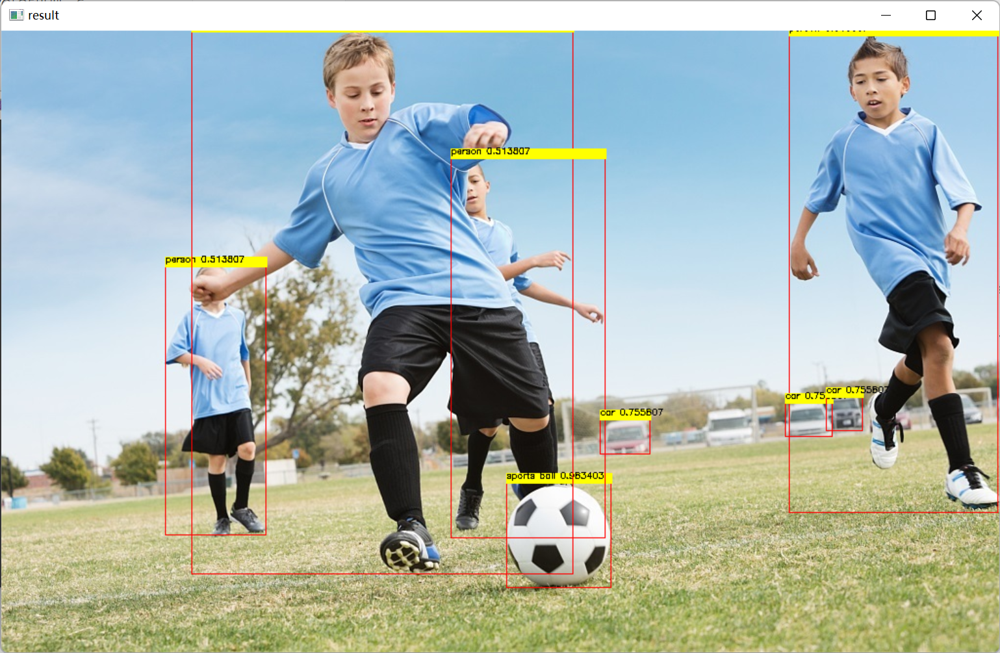

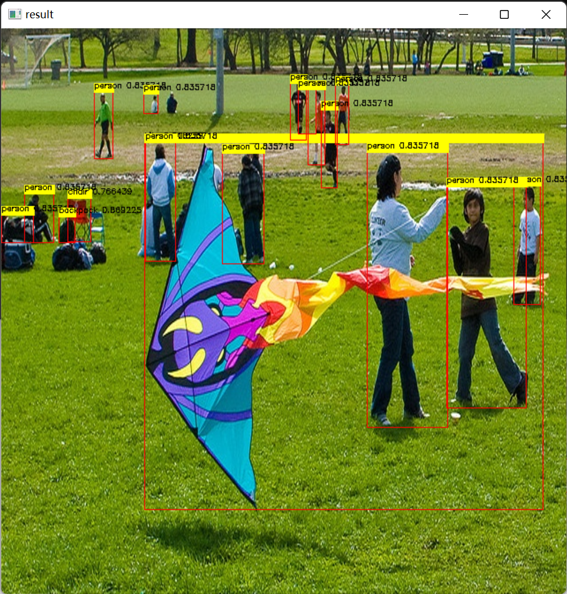

# 5. Python实现

## 5.1 环境安装

&emsp;OpenVINO<sup>TM</sup>工具套件2022.1版于2022年3月22日正式发布，与以往版本相比发生了重大革新，提供预处理API函数、ONNX前端API、AUTO 设备插件，并且支持直接读入飞桨模型，在推理中中支持动态改变模型的形状，这极大地推动了不同网络的应用落地。2022年9月23日，OpenVINO<sup>TM</sup> 工具套件2022.2版推出，对2022.1进行了微调，以包括对英特尔最新 CPU 和离散 GPU 的支持，以实现更多的人工智能创新和机会。

&emsp;此处选用OpenVINO<sup>TM</sup> 2022.2 版本，对于Python本，我们可以直接使用PIP命令安装。建议使用Anaconda 创建虚拟环境安装，对于最新版，在创建好的虚拟环境下直接输入以下命令进行安装：

```
// 更新pip
python -m pip install --upgrade pip
// 安装
pip install openvino-dev[ONNX,tensorflow2]==2022.2.0
```

&emsp;安装过程中如出现下载安装包错误以及网络等原因时，可以重新运行安装命令，会继续上一次的安装。

## 5.2 创建推理类 Predictor

```python
from openvino.runtime import Core
class Predictor:
    """
    OpenVINO 模型推理器
    """
    def __init__(self, model_path):
        ie_core = Core()
        model = ie_core.read_model(model=model_path)
        self.compiled_model = ie_core.compile_model(model=model, device_name="CPU")
    def get_inputs_name(self, num):
        return self.compiled_model.input(num)
    
    def get_outputs_name(self, num):
        return self.compiled_model.output(num)
    
    def predict(self, input_data):
        return self.compiled_model([input_data])
        
```

&emsp;此处由于只进行PP-YOLOE模型推理，所以只简单地封装一下Predictor类：主要包括初始化函数，负责读取本地模型并加载到指定设备中；获取输入输出名称函数以及模型预测函数。


## 5.3 数据处理方法

### 5.3.1 输入图片预处理

```python
def process_image(input_image, size):
    """输入图片与处理方法，按照PP-Yoloe模型要求预处理图片数据

    Args:
        input_image (uint8): 输入图片矩阵
        size (int): 模型输入大小

    Returns:
        float32: 返回处理后的图片矩阵数据
    """
    max_len = max(input_image.shape)
    img = np.zeros([max_len,max_len,3],np.uint8)
    img[0:input_image.shape[0],0:input_image.shape[1]] = input_image # 将图片放到正方形背景中
    img = cv.cvtColor(img,cv.COLOR_BGR2RGB)  # BGR转RGB
    img = cv.resize(img, (size, size), cv.INTER_NEAREST) # 缩放图片
    img = np.transpose(img,[2, 0, 1]) # 转换格式
    img = img / 255.0 # 归一化
    img = np.expand_dims(img,0) # 增加维度
    return img
```

&emsp;根据 PP-YOLOE模型输入要求，处理图片数据，主要包括图片通道转换、图片缩放、转换矩阵、数据归一化以及增加矩阵维度。按照PP-YOLOE模型输入设置，归一化方式是直接将像素点除255，将输入数据整合到0~1之间，加快模型的计算。PP-YOLOE模型ONNX格式只支持bath_size=1的推理，所以最后将数据矩阵维度直接增加一个维度即可。

### 5.3.2 模型输出结果处理

```python
def process_result(box_results, conf_results):
    """按照PP-Yolove模型输出要求，处理数据，非极大值抑制，提取预测结果

    Args:
        box_results (float32): 预测框预测结果
        conf_results (float32): 置信度预测结果
    Returns:
        float: 预测框
        float: 分数
        int: 类别
    """
    conf_results = np.transpose(conf_results,[0, 2, 1]) # 转置
    # 设置输出形状
    box_results =box_results.reshape(8400,4) 
    conf_results = conf_results.reshape(8400,80)
    scores = []
    classes = []
    boxes = []
    for i in range(8400):
        conf = conf_results[i,:] # 预测分数
        score = np.max(conf) # 获取类别
        # 筛选较小的预测类别
        if score > 0.5:
            classes.append(np.argmax(conf)) 
            scores.append(score) 
            boxes.append(box_results[i,:])
    scores = np.array(scores)
    boxes = np.array(boxes)
    # 非极大值抑制筛选重复的预测结果
    indexs = tf.image.non_max_suppression(boxes,scores,len(scores),0.25,0.35)
    # 处理非极大值抑制后的结果
    result_box = []
    result_score = []
    result_class = []
    for i, index in enumerate(indexs):
        result_score.append(scores[index])
        result_box.append(boxes[index,:])
        result_class.append(classes[index])
    # 返沪结果转为矩阵
    return np.array(result_box),np.array(result_score),np.array(result_class)
```

&emsp;由于我们所使用的PP-YOLOE被我们裁剪过，因此模型的输出是未进行处理的结果数据，模型输出节点有两个，一个为预测框输出，一个节点为置信值输出，所以后期需要对输出结果进行处理。

&emsp;置信度结果输出形状为[1, 80, 8400]，而实际80代表的一个预测结果对应的80个类别的置信值，而8400表示有8400个预测结果；而预测框输出结果为形状为[1, 8400, 4]，对应了8400个预测结果的预测框，其中4代表预测框的左上顶点预右下顶点的横纵坐标。

&emsp;因此结果处理主要包含以下几个方面：

- 置信度结果转置处理，并提取预测结果最大的类别、预测分数和对应的预测框；
- 非极大值抑制提取预测框和类别。

### 5.3.3 绘制预测结果

```python
def draw_box(image, boxes, scores, classes, lables):
    """将预测结果绘制到图像上

    Args:
        image (uint8): 原图片
        boxes (float32): 预测框
        scores (float32): 分数
        classes (int): 类别
        lables (str): 标签

    Returns:
        uint8: 标注好的图片
    """
    scale = max(image.shape) / 640.0 # 缩放比例
    for i in range(len(classes)):
        box = boxes[i,:]

        x1 = int(box[0] * scale)
        y1 = int(box[1] * scale)
        x2 = int(box[2] * scale)
        y2 = int(box[3] * scale)
        
        lable = lables[classes[i]]
        score = scores[i]
        cv.rectangle(image, (x1, y1), (x2, y2), (0,0,255), 2, cv.LINE_8)
        cv.putText(image,lable+":"+str(score),(x1,y1-10),cv.FONT_HERSHEY_SIMPLEX, 0.55, (0, 0, 255), 2)
        
    return image
```

&emsp;上一步经过结果处理，最终获得预测框、分数以及类别，最后通过OpenCV将预测结果绘制到图片上，主要是一个预测框绘制和分数、类别的书写两步。


## 5.4 模型推理


```python
    '''-------------------1. 导入相关信息 ----------------------'''
    # yoloe_model_path = "E:/Text_Model/pp-yoloe/ppyoloe_plus_crn_s_80e_coco.onnx"
    yoloe_model_path = "E:/Text_Model/pp-yoloe/ppyoloe_plus_crn_s_80e_coco.xml"
    image_path = "E:/Text_dataset/YOLOv5/0001.jpg"
    lable_path = "E:/Git_space/基于OpenVINO部署PP-YOLOE模型/model/lable.txt";
    '''-------------------2. 创建模型预测器 ----------------------'''
    predictor = Predictor(model_path = yoloe_model_path)
    '''-------------------3. 预处理模型输入数据 ----------------------'''
    image = cv.imread(image_path)
    input_image = process_image(image, 640)
    '''-------------------4. 模型推理 ----------------------'''
    results = predictor.predict(input_data=input_image)
    '''-------------------5. 后处理预测结果 ----------------------'''
    boxes_name = predictor.get_outputs_name(0)
    conf_name = predictor.get_outputs_name(1)
    
    boxes, scores, classes = process_result(box_results=results[boxes_name], conf_results=results[conf_name]) # 处理结果
    lables = read_lable(lable_path=lable_path) # 读取lable
    result_image = draw_box(image=image, boxes=boxes, scores=scores, classes=classes, lables=lables) # 绘制结果
    cv.imshow("result",result_image)
    cv.waitKey(0)
```

&emsp;根据模型推理流程，最后调用模型推理类进行实现：

- 导入相关信息：主要是定义模型地址、待预测图片地址和类别文件；
- 创建模型预测器：主要初始化预测类，读取本地模型，此处可以读取ONNX模型和IR模型两种格式；
- 预处理图片：调用定义的图片处理方法，将本地图片数据转为模型推理的数据；
- 模型推理：将处理好的图片数据加载到模型中，并获取模型推理结果；
- 处理模型结果：主要是调用结果处理方法实现，如果需要可视化，可以将预测结果绘制到图片中。