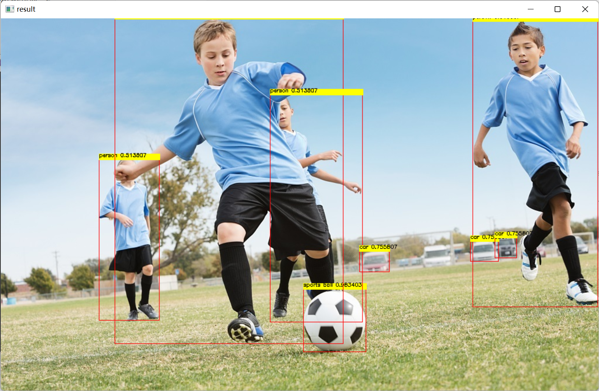

# OpenVINO<sup>TM</sup>部署PaddlePaddle YOLOE模型—C++

# 1. C++项目配置

&emsp; 当前项目部署套件使用的是OpenVINO<sup>TM</sup>，图片处理使用的是OpenCV，所以此处需要配置OpenVINO<sup>TM</sup>和OpenCV两个附加依赖项。

&emsp;项目使用OpenVINO<sup>TM</sup>版本为2022.2，OpenCV版本使用的是4.5.5，具体安装方式可以参考下面三个链接：

[【OpenVINO】OpenVINO 2022.1 安装教程(Windows)](https://blog.csdn.net/grape_yan/article/details/126943858)

[【OpenVINO】OpenVINO 2022.1更新2022.2教程](https://blog.csdn.net/grape_yan/article/details/127022258)

[OpenCV C++安装和配置](https://blog.csdn.net/grape_yan/article/details/126954261)


# 2. 模型推理类 Predictor

### 2.1 推理结构体核心

```c++
// @brief 推理核心结构体
typedef struct openvino_core {
    ov::Core core; // core对象
    std::shared_ptr<ov::Model> model_ptr; // 读取模型指针
    ov::CompiledModel compiled_model; // 模型加载到设备对象
    ov::InferRequest infer_request; // 推理请求对象
} CoreStruct;
```

&emsp;为了方便使用OpenVINO<sup>TM</sup>推理工具，此处将该套件较为重要的几个成员变量封装成推理核心结构体，方便模型在不同方法之间传递。

### 2.2 Predictor类结构

```c++
class Predictor {
public:
    // 构造函数
    Predictor(std::string& model_path, std::string& device_name);
    // 析构函数
    ~Predictor() { delete p; }
    // 获取节点张量
    ov::Tensor get_tensor(std::string node_name);
    // 填充图片数据
    void fill_tensor_data_image(ov::Tensor& input_tensor, const cv::Mat& input_image);
    void fill_tensor_data_image(ov::Tensor& input_tensor, const std::vector<cv::Mat> input_image);
    // 模型推理
    void infer();
    // 获取模型输出
    std::vector<float> get_output_data(std::string output_node_name);
private:
    CoreStruct* p;
};
```

&emsp;由于我们此处只进行PP-YOLOE模型的推理，所以无需构建太复杂的推理类，主要包括

- 构造函数``Predictor(model_path, device_name)``：主要实现功能为初始化推理核心，包括读取本地模型，将模型加载到设备，创建推理通道三个步骤；
- 获取节点张量``get_tensor(node_name)``：主要实现功能获取指定节点的张量，主要用于获取输入节点张量；
- 填充输入数据``fill_tensor_data_image(input_tensor, input_image)``：主要实现将带推理数据添加到模型中，支持添加单张图片数据和多通道推理下的多张图片添加；
- 模型推理``infer()``：模型推理功能，按照读取的模型和加载的推理数据计算模型；
- 读取模型输出``get_output_data(output_node_name)``：读取推理模型的输出。

&emsp;针对上诉方法的实现可以参考源码，此处不做详细解释。

# 3. 图片数据处理类 ImageProcess

```c++
class ImageProcess {
public:
	// 预处理图片
	cv::Mat image_normalize(cv::Mat& sourse_mat, cv::Size& size);
	// 处理推理结果
	cv::Mat yoloe_result_process(cv::Mat& sourse_mat, std::vector<float>& vector_box, std::vector<float>& vector_conf);
	// 读取lable文件
	void read_class_names(std::string path_name);
	// 设置缩放比例
	void set_scale_factor(double scale);
private:
	// 缩放比例
	double scale_factor;
	// lable容器
	std::vector<std::string> class_names;
};
```

&emsp;此处设置一个数据处理类主要用于处理模型的输入输出数据，主要不包括先买几个方法：

- 预处理图片``image_normalize(sourse_mat, size);``：预处理图像数据，包括以下几个处理步骤：1.转换RGB 2.缩放图片  3.图片归一化；
- 处理PP-YOLOE结果``yoloe_result_process(sourse_mat, vector_box, vector_conf)``：由于我们将模型进行了裁剪，去除了模型自带的后处理以及非极大值抑制，因此模型的输出数据较复杂，此处封装该方法主要实现将模型读取的数据按照指定要求进行处理，并绘制到结果图片上；
- 读取lable文件``read_class_names(path_name)``：读取本地lable.txt文件；
- 设置缩放比例``set_scale_factor(scale)``：设置原图与模型输入的缩放比例，用于回复模型预测框。

# 4. 模型推理实现

### 4.1 定义相关信息

```c++
// 模型路径
//std::string model_path = "../model/ppyoloe_plus_crn_s_80e_coco.onnx";
std::string model_path = "../model/ir/ppyoloe_plus_crn_s_80e_coco.xml";
// 设备名称
std::string device_name = "CPU";
// 输入节点
std::string input__node_name = "image";
// 输出节点名
std::string output_box_node_name = "tmp_16";
std::string output_conf_node_name = "concat_14.tmp_0";

// 测试图片
std::string image_path = "../image/demo_3.jpg";
// 类别文件
std::string lable_path = "../model/lable.txt";
```

&emsp;首先定义相关的信息，此处推理可以使用ONNX模型和IR模型；模型输入节点为``image``，输出节点为：

``tmp_16``预测框输出节点，``concat_14.tmp_0``置信度输出，利用OpenVINO<sup>TM</sup>工具可以直接读取该模型节点名称，此处直接定义使用。

### 4.2 预处理推理数据

```c++
// 创建数据处理类
ImageProcess image_pro;
// 读取类别文件
image_pro.read_class_names(lable_path);
// 图片预处理
cv::Mat image = cv::imread(image_path);
cv::Size input_size(640, 640);
// 将图片放到方形背景中
int length = image.rows > image.cols ? image.rows : image.cols;
cv::Mat input_mat = cv::Mat::zeros(length, length, CV_8UC3);
cv::Rect roi(0, 0, image.cols, image.rows);
image.copyTo(input_mat(roi));

// 设置缩放比例
image_pro.set_scale_factor((double)length / 640.0);

// 归一化处理
cv::Mat input_data = image_pro.image_normalize(input_mat, input_size);
```

&emsp;此处推理数据预处理主要使用类``ImageProcess``中定义的方法实现，PP-YOLOE模型输入为3×640×640，形状为正方形，因此此处采用将推理数据放在一个较大的正方形背景中，防止图片形状在缩放时发生变形。

### 4.3 模型推理

```c++
// 创建推理通道
Predictor predictor(model_path, device_name);
// 加载模型推理数据
ov::Tensor input_tensor = predictor.get_tensor(input__node_name);
predictor.fill_tensor_data_image(input_tensor, input_data);
// 模型推理
predictor.infer();
```

&emsp;此处通过调用前面定义的Predictor类实现，初始化Predictor类，将模型读取到内存中，并加载到指定设备，创建推理通道；接下来就是加载预处理完的推理数据到模型上；最后进行模型推理。

### 4.4  处理推理结果

```c++
// 读取推理结果
std::vector<float> result_boxes = predictor.get_output_data(output_box_node_name);
std::vector<float> result_conf = predictor.get_output_data(output_conf_node_name);
// 处理推理结果
cv::Mat result_image = image_pro.yoloe_result_process(image, result_boxes, result_conf);
```

&emsp;PP-TYOLOE模型经过我们裁剪后共有两个输出节点，一个负责输出预测框，一个负责输出置信值，将预测结果读取后，调用推理结果处理方法进行处理。

# 5. 模型推理效果

&emsp;使用该模型，分别预测了两个图片，预测结果可以查看下面两个图。




